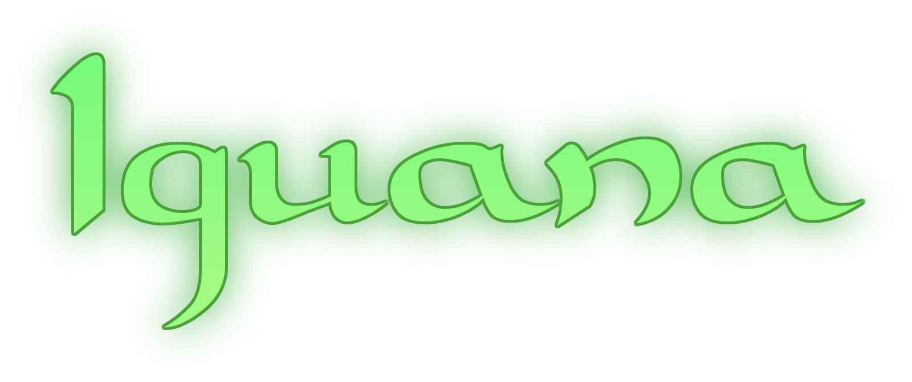

## Iguana: Implementation Guardian of Analysis Algorithms

The primary goal of Iguana is to preserve and centralize common analysis algorithms, such as fiducial cuts, momentum corrections, and kinematics reconstruction.

Support is focused on HIPO data for CLAS12, but extending support to other data formats (experiments) may be feasible.

Iguana is not a framework for _reading_ data, rather it is a set of algorithms to _mutate_ the data. For HIPO data, algorithms mutate banks. See the [API documentation](https://jeffersonlab.github.io/iguana/doxygen) for the list of available algorithms.

> [!CAUTION]
> Iguana is still in the early stages of development. Please see [the issues page](https://github.com/JeffersonLab/iguana/issues) for known issues and development plans.

## Documentation

### For Users
1. [**Iguana User's Guide**](https://jeffersonlab.github.io/iguana/doxygen)
1. [Setup Guide - how to build and install Iguana](doc/setup.md)
1. [Configuring the Algorithms](doc/configuration.md)
1. [Troubleshooting](doc/troubleshooting.md)

#### Language Bindings
1. [Python](/bind/python/README.md)
1. [All others: see the Iguana User's guide](https://jeffersonlab.github.io/iguana/doxygen)

### For Developers
1. [Design Notes](doc/design.md)
1. [Developing a new Algorithm](src/iguana/algorithms/example/ExampleAlgorithm/README.md)
1. [Algorithm Tests and Validators](doc/testing.md)
1. [Repository Maintenance](doc/maintenance.md)
1. [Building for `cvmfs` or `ifarm`](doc/ifarm.md)

## Status
1. [Coverage Report](https://jeffersonlab.github.io/iguana/coverage-report)
