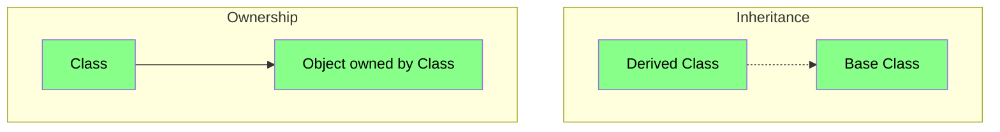
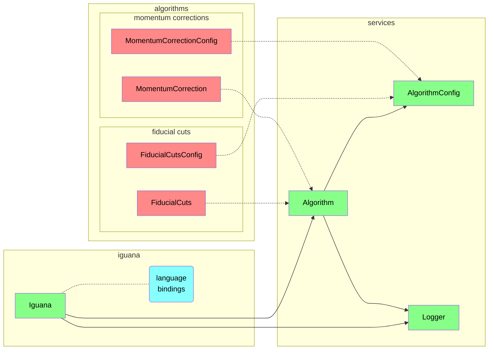

# Design

## Class Diagram

### Legend

```mermaid
flowchart TB
    classDef cls fill:#88ff88,color:black

    subgraph Inheritance 
        b[Base Class]:::cls
        d[Derived Class]:::cls
    end
    d -.-> b

    subgraph Ownership
       c[Class]:::cls
       o[Object owned by Class]:::cls
    end
    c ---> o
```

### Iguana Design

```mermaid
flowchart LR
    classDef cls fill:#88ff88,color:black
    classDef algo fill:#ff8888,color:black
    classDef other fill:#88ffff,color:black

    subgraph iguana
        Iguana:::cls
        bindings(language<br />bindings):::other
    end

    subgraph services
        Algorithm:::cls
        AlgorithmConfig:::cls
        Logger:::cls
    end

    subgraph algorithms
        subgraph fiducial cuts
            FiducialCuts:::algo
            FiducialCutsConfig:::algo
        end
        subgraph momentum corrections
            MomentumCorrection:::algo
            MomentumCorrectionConfig:::algo
        end
    end

    Iguana    ---> Logger
    Iguana    ---> Algorithm
    Iguana    -.-  bindings
    Algorithm ---> Logger
    Algorithm ---> AlgorithmConfig

    FiducialCuts       -.-> Algorithm
    FiducialCutsConfig -.-> AlgorithmConfig
    MomentumCorrection       -.-> Algorithm
    MomentumCorrectionConfig -.-> AlgorithmConfig
```
