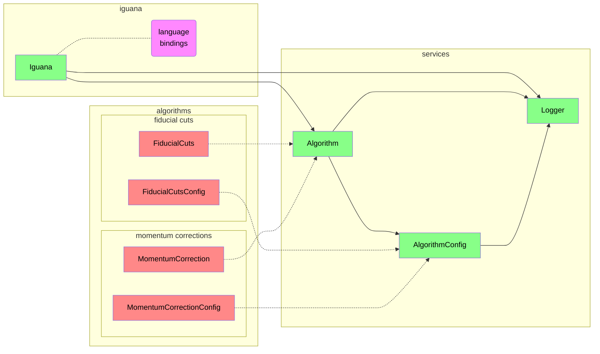
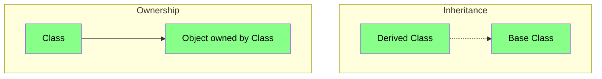
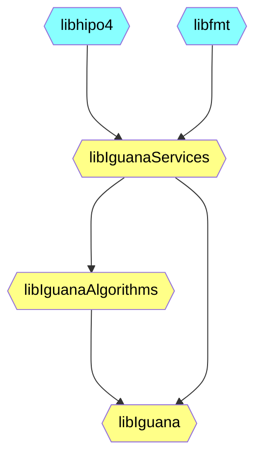

# Design

## Graphs

### Class Diagram

#### Legend

### Dependency Graph

## Algorithm Design

### Common Methods

Base class `Algorithm` has virtual methods:

#### `Start`
- runs before any event processing
- configuration
- set up data structures

#### `Run`
- runs on every event
- input and output are a set of banks (`std::unordered_map< std::string, hipo::bank>`)
- runs the algorithm for a given event's bank(s)
- should be thread-safe, _e.g._, no modification of instance members
- usage:
    - called on every event in an event loop
    - part of a lambda for a data frame transformation
- analyses that operate on bank rows rather than full banks require exposure
  of some function that does the _primary_ action of the algorithm
    - useful to have
    - wide variety of function signatures, so not easy to generalize and therefore not required

#### `Stop`
- runs after event processing
- cleanup, if needed

### Usage Options for Users

- Instantiate and run algorithms as they are
    - No need for `Iguana` instance
    - Algorithms do not depend on `Iguana`, just on services
    - All algorithms are available in a separate shared library
    - Drawback: language bindings are not planned at the algorithm level
- Use `Iguana`
    - `Iguana` will only instantiate the algorithms the user intends to use, owning
      an instance of each
    - User runs the algorithms using `Iguana` "sugar"
    - Language bindings can be made available at this level

### Algorithm Types

#### Filter
- return an input bank with some rows masked (or removed)
    - masking preferred to preserve bank linking
    - options for masking a row:
        - zero all elements
        - add a boolean item to the _end_ of the schema to store whether a row is masked
- public `bool Cut(float...)` function
    - expose the _primary_ action of the algorithm for users that operate on bank rows
    - not required, since difficult to generalize at the `Algorithm` (or `Iguana`) level
    - similar to `chanser`'s RG-A criteria implementations

#### Transformer
- return an input bank with some elements modified
- public `Transorm(...)` function that exposes the _primary_ algorithm action would be useful,
  but not required

#### Creator
- return a new bank with a new schema
- many reconstruction algorithms are creators

#### Hybrid
- any combination of the above
