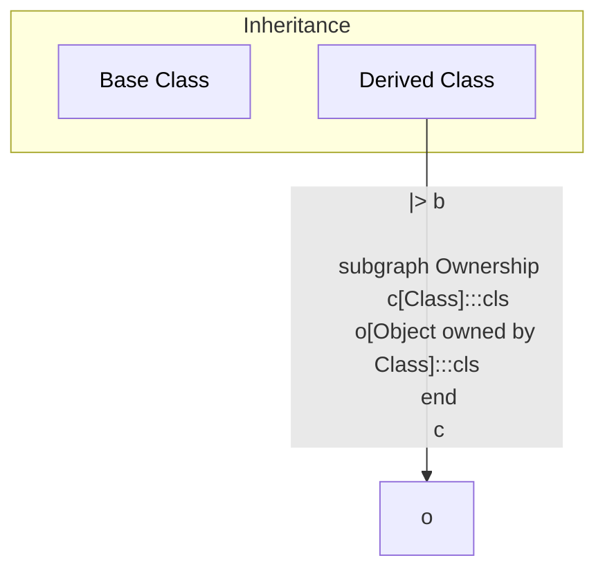

# Design

## Class Diagram

### Legend



### Iguana Design

```mermaid
flowchart TB
    classDef cls fill:88ff88,color:black
    classDef algo fill:ff8888,color:black

    subgraph iguana
        Iguana:::cls
    end

    subgraph services
        Algorithm:::cls
        AlgorithmConfig:::cls
        Logger:::cls
    end

    subgraph algorithms
        FiducialCuts:::algo
        FiducialCutsConfig:::algo
        MomentumCorrection:::algo
        MomentumCorrectionConfig:::algo
    end

    Iguana    --> Logger
    Iguana    --> Algorithm
    Algorithm --> Logger
    Algorithm --> AlgorithmConfig

    FiducialCuts       --|> Algorithm
    FiducialCutsConfig --|> AlgorithmConfig
    MomentumCorrection       --|> Algorithm
    MomentumCorrectionConfig --|> AlgorithmConfig
```
